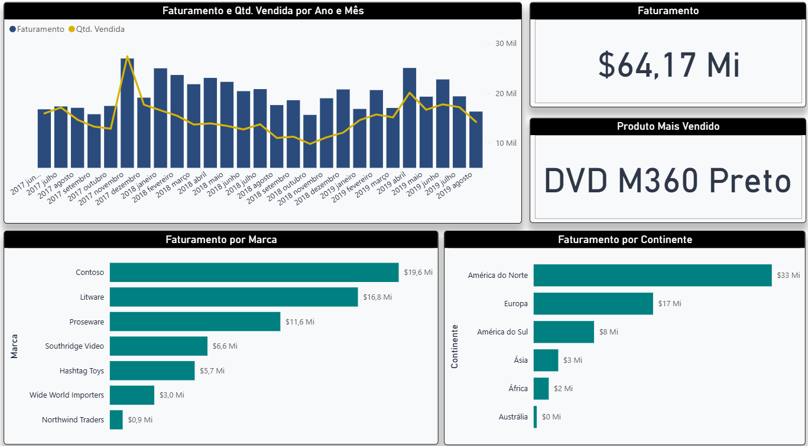

# 📊 Dashboard de Performance de Vendas Globais

Este repositório contém o projeto de Business Intelligence desenvolvido para analisar o faturamento e a performance de vendas de uma base de dados corporativa. O objetivo foi transformar dados brutos em insights estratégicos aplicados a cenários reais de tomada de decisão.

## 🚀 Destaques do Projeto

*   **Modelagem de Dados:** Estruturação de dados para cruzar faturamento e quantidade de itens vendidos ao longo do tempo.
*   **Design & UX Corporativo:** Substituição de paletas de cores saturadas por uma identidade visual sóbria e moderna em tons de verde-petróleo e azul-escuro. A escolha foca em melhorar o contraste de leitura e reduzir a fadiga visual do usuário técnico.
*   **KPIs Estratégicos:** Criação de cartões minimalistas para leitura rápida das principais métricas de faturamento e produtos mais vendidos.

## 🛠️ Tecnologias Utilizadas

*   **Power BI Desktop** (Construção dos visuais, ETL e Modelagem)
*   **Linguagem DAX** (Criação de medidas e cálculos de negócio)

## 📁 Como Auditar o Projeto Técnico

Como o ambiente foi desenvolvido sob políticas restritas de governança de dados institucionais (sem publicação em link público), o arquivo fonte original está totalmente disponível para auditoria.

Você pode fazer o download do arquivo **`.pbix`** diretamente neste repositório para inspecionar:
1. A modelagem de tabelas e relacionamentos.
2. As fórmulas e medidas DAX aplicadas.
3. O tratamento de dados no Power Query.
